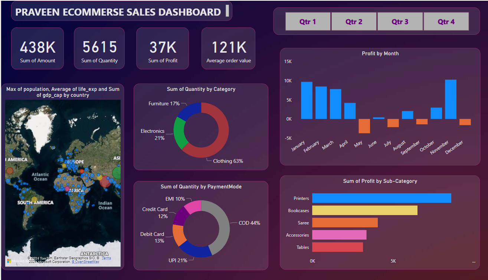
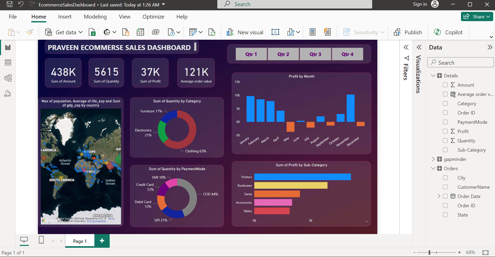

# E-commerce Online Sales Dashboard

This repository contains the project files and documentation for the development of an online sales dashboard for Kapoor and Sons using Power BI. The dashboard provides insightful visualizations and analytics to track and analyze online sales performance across various regions in India.

## Features:

- **Sales Performance Tracking**: Monitor overall sales trends and performance metrics.
- **Regional Analysis**: Analyze sales data segmented by different regions across India.
- **Product Insights**: Track the performance of individual products and categories.
- **Customer Analysis**: Gain insights into customer demographics and purchasing behavior.
- **Time Series Analysis**: Observe sales trends over time to identify patterns and seasonality.

## Technologies Used:

- **Power BI**: For creating the dashboard and visualizations.
- **Excel/CSV Files**: For data storage and manipulation.
- **DAX (Data Analysis Expressions)**: For data modeling and calculations.

## Installation and Setup:

1. Clone this repository to your local machine:
    ```bash
    git clone https://github.com/Praveenkumartiwari321/Ecommerce-Sales-Dashboard.git
    ```

2. Open the Power BI Desktop application.

3. Load the provided data files into Power BI.

4. Import the Power BI template file (`.pbix`) from this repository.

5. Refresh the data connections and ensure that all data is correctly loaded and visualizations are rendering as expected.

## Usage:

- Open the Power BI dashboard file (`kapoor-and-sons-dashboard.pbix`).
- Use the interactive filters and slicers to explore different aspects of the sales data.
- Analyze the visualizations to gain insights into sales performance, regional trends, product popularity, and customer behavior.

## Screenshots


*Screenshot of the main dashboard overview.*


*Screenshot of the regional sales analysis section.*

## Contributing

Contributions are welcome! Please fork this repository and submit a pull request with your proposed changes.

## License

This project is licensed under the MIT License. 

## Contact

For any questions or inquiries, please contact [Praveen Kumar Tiwari](mailto:praveenkumartiwari321@gmail.com).
